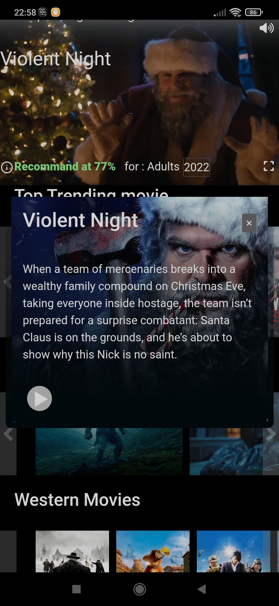
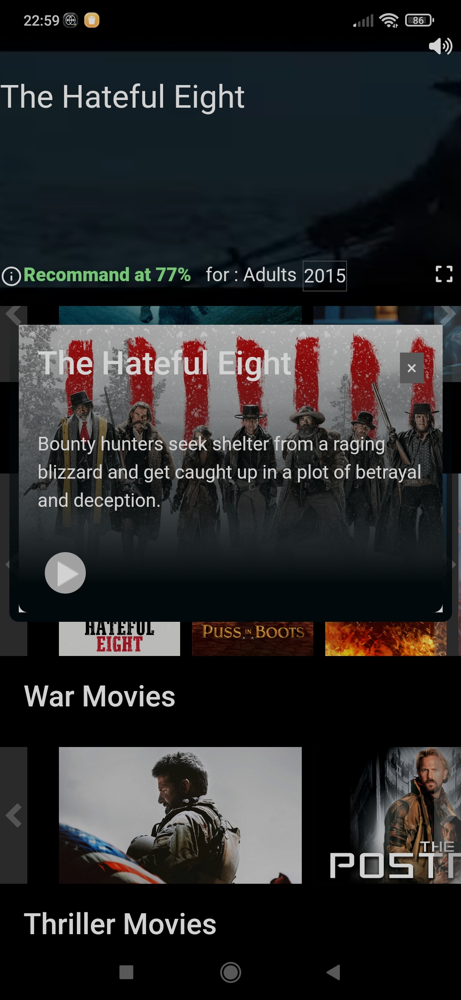
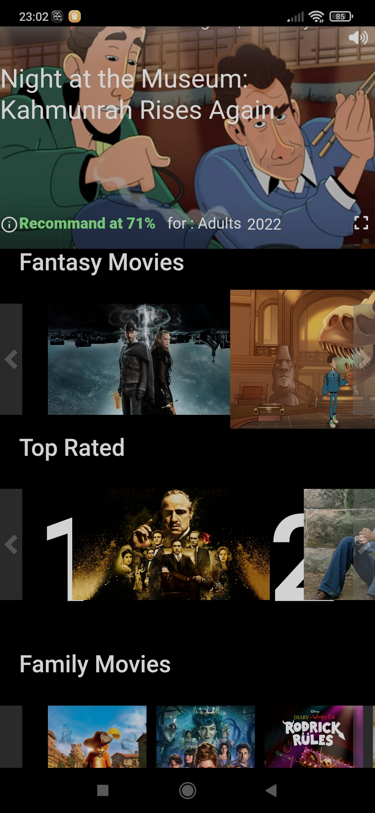

# Netflix Clone movies trailer Android

This repository is an update of [Netflix_clone](https://github.com/ismailazdad/Netflix_clone) developing with React.js with some UI modifications for a better mobile experience.
I use  [Capacitor](https://github.com/ionic-team/capacitor) to convert React.js project to native Android project.
     
[](https://play.google.com/store/apps/details?id=com.moviestrailer.app)     


### Tutorial 
How to convert project to native app with capacitor : 

[tutorial](https://capacitorjs.com/docs/getting-started)

[tutorial android](https://capacitorjs.com/docs/android)

you can handle native event in your project using capacitor bridge to handle or modify wanted behavior

[handle native listenner](https://capacitorjs.com/docs/apis/app)

[icon app](https://capacitorjs.com/docs/guides/splash-screens-and-icons)

### Install capacitor

Run this command on the root of the project 

```npm i @capacitor/core```

```npm i -D @capacitor/cli```

```npx cap init```

```npm i @capacitor/android```

```npx cap add android```

```npx cap sync```

```npx cap run android```

### Icon for Android

Create a folder ```resources``` in the root of your project with ```icon.png``` and ```splash.png```

```npm install -g cordova-res```

```cordova-res android --skip-config --copy```

Synchronize your project to update android project folder

```npm run build```

```npx cap sync```

Go to Android Studio to fix all images declination for devices


 
### Preview





