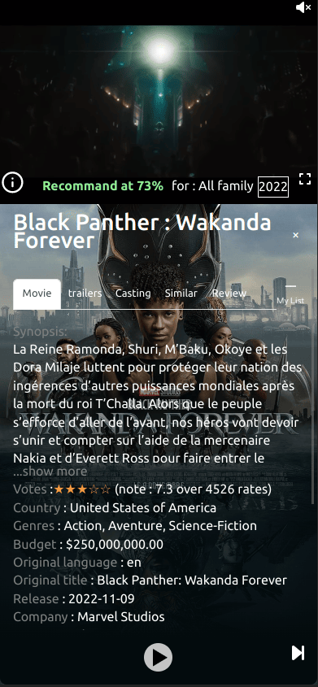
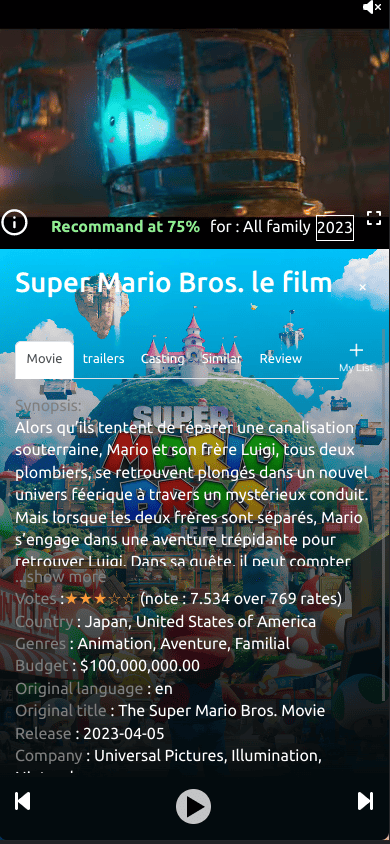
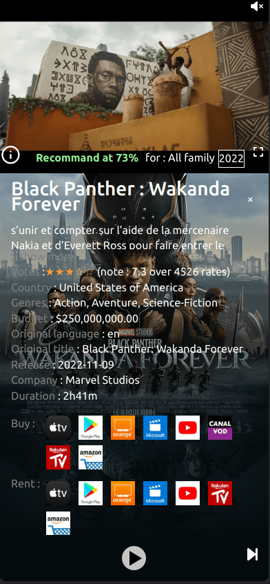
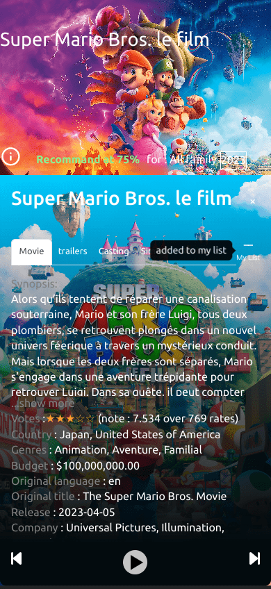

# Netflix Clone movies trailer Android


This repository was based on a idea, Make my own Netflix clone.
For this challenge i wanted to see all informations
 about a movie and in same time see all trailers available.

## Description 

Watch the lastest trailers quickly and easily like a famous streaming app.
Search for a movie , show movie details like casting or production focus on user experience

MoviesTrailer app allows you to see trailers of all popular movies, primarily in your native language. Search for an actor or director..., get the filmography  and the resume of an actor.Search any movie, find information about it and see the list of trailers for the same movie very easily.
Make your own movie favorite list quickly 

• Make you own movies 

• Show actor or director filmography

• Casting of the movie

• Get similar movies

• Manage all main languages

• Get the reviews of a movie 

• Get the list of provider for movies available in your country

• Results according to your preferred language

• View all upcoming movie trailers.

• Get a list of currently popular movies.

• Get a list of top rated movies.

• Search any movie with its information: title, rating, release date, language, genres, synopsis, production...

### Download and install movies trailer app

[Web mobile app WPA](https://netflix_wpa.surge.sh/)
   
[](https://play.google.com/store/apps/details?id=com.moviestrailer.app)

### Tools used
 - Add capacitor for Android conversion 
 - Add WPA Web progressive app for faster rendering
 - All modern browsers (including mobile) with css media query
 - Route maping for rendering mutliples pages with react router  with parameters(dynamic route generation)
 - Bootstrap modal
 - GlobalStyle, and style.jsx and styled component
 - Hooks and UseContext to synchronize data context
 - TMDB Api 
 - Handle environment variable with .env    

if someone can do the same for ios and push the app to the apple store, it will be awesome :boom: :neckbeard: :monkey_face:

## Running Project Locally

Clone Project : 

```git clone https://github.com/ismailazdad/NetflixClone_Capacitor_Android.git```

Go to project directory :

```cd NetflixClone_Capacitor_Android/```

Install dependencies:  

```npm install``` in the root project

Get API key from [here](https://www.themoviedb.org/signup)

Change ```.env``` file in root project and replace  ```YOUR_API_KEY_HERE``` by your personnal themoviedb key

Run project: 

```npm run start```

Open [http://localhost:3000](http://localhost:3000) to view it in your browser.


### Capacitor install and Tutorial 

I use  [Capacitor](https://github.com/ionic-team/capacitor) to convert React.js project to native Android project.

How to convert project to native app with capacitor : 

[tutorial](https://capacitorjs.com/docs/getting-started)

[tutorial android](https://capacitorjs.com/docs/android)

you can handle native event in your project using capacitor bridge to handle or modify wanted behavior

[handle native listenner](https://capacitorjs.com/docs/apis/app)

[icon app](https://capacitorjs.com/docs/guides/splash-screens-and-icons)

### Install capacitor

Run this command on the root of the project 

```npm i @capacitor/core```

```npm i -D @capacitor/cli```

```npx cap init```

```npm i @capacitor/android```

```npx cap add android```

```npx cap sync```

```npx cap run android```

### Icon for Android

Create a folder ```resources``` in the root of your project with ```icon.png``` and ```splash.png```

```npm install -g cordova-res```

```cordova-res android --skip-config --copy```

Synchronize your project to update android project folder

```npm run build```

```npx cap sync```

Go to Android Studio to fix all images declination for devices


 
### Preview






